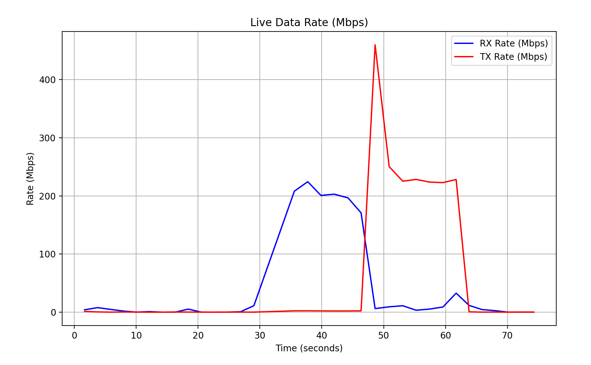

# MikroTik Data Rate Graphing Tool

This project visualizes the instantaneous RX (receive) and TX (transmit) data rates in Mbps for a MikroTik router using its REST API. The graph updates in real time, providing insights into the data traffic.



## How It Works
- The tool retrieves RX and TX bytes from the specified MikroTik router interface every second.
- It calculates the data rates in Mbps.
- The rates are plotted on a graph that updates continuously.

## Prerequisites
1. Ensure that your MikroTik router has REST API enabled and is properly configured.
2. Install Python 3.6 or newer.

## Setup Instructions
1. Clone or download this repository.
2. Open the Python script and modify the following variables to match your setup:
   - `ROUTER_HOST`: Set this to your MikroTik router's IP or hostname.
   - `INTERFACE`: Specify the name of the interface you want to monitor.
   - `USERNAME` and `PASSWORD`: Provide the login credentials for your MikroTik router.
3. Install the required Python modules by running:
   ```bash
   pip install -r requirements.txt
4. Run the script:
   ```bash
   python3 ./windowed.py

## Notes
- Before running, ensure the router and interface details are correct.
- This graphing tool is a work-in-progress. Further improvements to the visualization and functionality will be added when I have time.